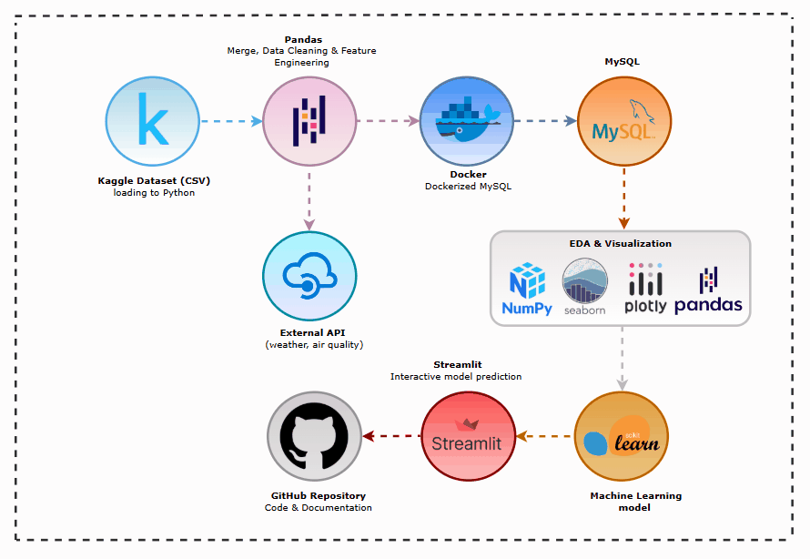

# London Road Accident Severity Prediction (End-to-End Project)

---

**Streamlit App:** [Road Accident Severity Predictor](https://hotel-booking-analysis-and-prediction-hbpea2024.streamlit.app/)

---

## Project Overview
This project is an end-to-end data science solution designed to predict whether a road traffic accident in London is severe or non-severe. To improve the predictive capability of the model, weather and air quality data were collected from external APIs and integrated with official UK road accident records. The project also includes extensive data cleaning, feature engineering, SQL database integration, exploratory data analysis, and machine learning.

---

### 📊 Dataset at a Glance
* **Original Dataset:** UK Road Accident Dataset (2005–2015).
* **Final Processed Data:** ~74,000 rows & 37 high-impact features.
* **Target Variable:** `Severe_Accident` (Binary: 0 for Slight Accident, 1 for Serious or Fatal Accident)

---

## 🔄 Project Workflow
The following animation illustrates the technical flow from data acquisition via API to model deployment:

---

## EDA: Key Insights (Q&A)
During the analysis, I extracted several critical findings from the data:

* **Q: Which factors have the strongest relationship with accident severity?**
    * **A:** Location plays a major role. Certain areas of London consistently exhibit a higher proportion of severe accidents.
* **Q: Does weather directly determine accident severity?**
    * **A:** Not entirely. While adverse weather conditions contribute to accident severity, weather alone is not a strong predictor.
* **Q: Does air quality influence severe accidents?**
    * **A:** Air quality indicators (PM2.5, PM10, NO₂, AQI) appear among the most important machine learning features, suggesting they provide useful complementary information.
* **Q: Do temporal factors matter?**
    * **A:** Yes. Accident severity varies by hour of the day and month of the year, indicating temporal patterns in traffic conditions.

---

## 🛠 Feature Engineering & Cleaning
To optimize the model, I performed:
* **Data Cleaning:** Removed records with missing latitude, longitude, and time values, verified duplicate accident records, and filtered the dataset to include only accidents that occurred in London between 2013 and 2015.
* **Target Engineering:** Converted the original three-class accident severity variable into a binary target, Severe_Accident, where Serious and Fatal accidents were labeled as 1, and Slight accidents as 0.
* **Datetime Features:** Extracted valuable temporal features such as Year, Month, Hour, and created Weather_Hour to align accident timestamps with hourly weather and air quality observations.
* **Categorical Encoding:** Applied One-Hot Encoding (OHE) to nominal categorical variables, enabling compatibility with machine learning algorithms.

---

## Machine Learning & Performance

I utilized a **Random Forest Classifier** to build the predictive model. The training process included:
* **Data Split:** **80% Train** / **20% Test** split.
* **Class Balancing:** Applied **Random Under-Sampling** to address the class imbalance before model training.
* **Categorical Handling:** All categorical nominal features were transformed using **One-Hot Encoding**.
* **Validation:** A **5-fold Cross-Validation** was performed to ensure the model generalizes well and to check for potential overfitting.

### 📈 Evaluation Metrics
| Metric | 0 (Slight) | 1 (Serious or Fatal) |
| :--- | :--- | :--- |
| **Accuracy** | 0.60 | 0.60 |
| **F1-Score** | 0.62 | 0.58 |
| **Precision** | 0.59 | 0.61 |
| **Recall** | 0.65 | 0.56 |

---

## Streamlit App & Prediction
The final model is integrated into a Streamlit interface to provide an interactive experience:

* **Feature Importance:** Users can visually see which factors most significantly influence the model's decision-making process.
* **Real-Time Prediction:** By providing accident-related information, including road conditions, location, weather, and air quality variables, the model predicts whether an accident is likely to be severe or non-severe.
